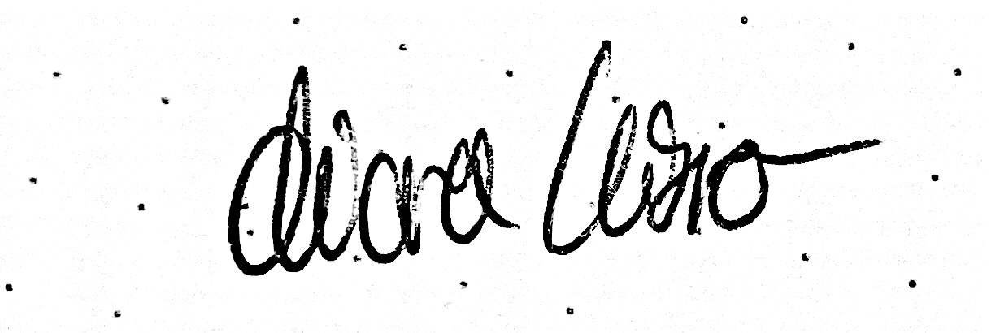

# 📝 Erklärung zur Eigenständigkeit (Phase 1)

**Projekt:** Entwicklung und Refaktorierung der Mayfly Optimization Suite  
**Modul:** Advanced Software-Engineering  
**Studierender:** Chiara Kisro 
**Matrikelnummer:** 8765488

---

Hiermit versichere ich, dass ich die Aufgabenstellungen der **Phase 1** (inklusive der mathematischen Grundlagen des Mayfly-Algorithmus, der initialen Code-Strukturierung sowie der Kern-Logik der Swarm-Intelligence-Simulation) vollständig **selbstständig und ohne den Einsatz von generativen KI-Werkzeugen** (wie ChatGPT, Gemini, Copilot o.Ä.) bearbeitet und umgesetzt habe.

Alle in dieser ersten Phase erstellten Programmkomponenten, algorithmischen Strukturen und logischen Verknüpfungen wurden von mir eigenhändig entworfen, programmiert und getestet.

Der Einsatz von KI-Unterstützung (wie im *AI Usage Log* für Phase 2 dokumentiert) erfolgte erst ab Beginn der **Phase 2** und beschränkte sich ausschließlich auf die dort explizit ausgewiesenen Aufgabenbereiche (Reporting, Export-Schnittstellen, statistische Aggregate und die dazugehörige Dokumentation).

---

Bad Mergentheim, den 06. Juni 2026

