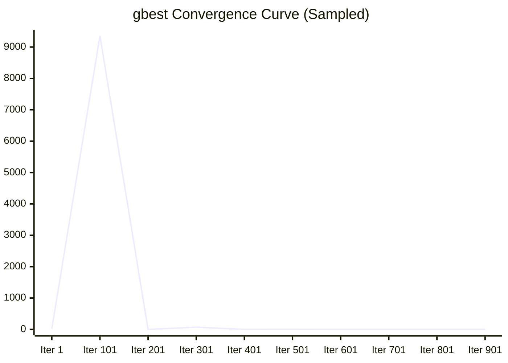

# 📑 Mayfly Algorithm Optimization Report

## ⚙️ Meta-Information & Configuration

| Property | Value |
| :--- | :--- |
| **Execution Timestamp** | 2026-06-05T18:34:00.263319300Z |
| **Random Seed** | 42 |
| **Dimensions (D)** | 10 |
| **Population Size** | 40 |
| **Max Iterations** | 1000 |
| **Tooling Versions** | Java 25, IntelliJ 2024.1.1, GraalVM |

## 📉 Visual gbest Convergence (Sparkline)

Trajectory: `█▇▆▆▅▄▄▃▃▃▃▂▂▂▂▂▂▂▂▂▂▂▂▂                                                                                                                                                                                                                                                                                                                                                                                                                                                                                                                                                                                                                                                                                                                                                                                                                                                                                                                                                                                                                `

## 📊 Analyzer Key Metrics

### 🔍 GlobalMemoryAnalyzer

| Metric | Value |
| :--- | :--- |
| Gbest Update Count | 525 |
| First Hitting Iteration | 630 |

### 🔍 AgentInteractionAnalyzer

| Interaction Type | Count |
| :--- | :--- |
| Nuptial Dance (Male) | 1000 |
| Attraction Count | 39000 |

## 🗺️ Convergence & Plateau Diagram

