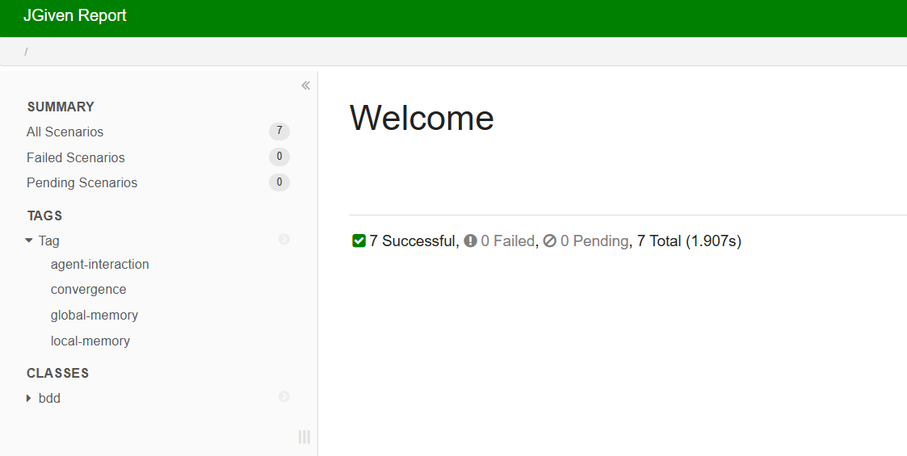

# 🛸 Mayfly Optimization Suite — Analytics Framework

This repository implements a stateless, decoupled variant of the **Mayfly Swarm Intelligence Optimization Algorithm** featuring real-time telemetry extraction, native serialization strategies, and multi-run statistical evaluation.

> **Build-Tool:** Apache Maven — gewählt wegen standardisierter Plugin-Ökosysteme (JaCoCo, JGiven), reproduzierbaren Dependency-Locks und breiter IDE-Unterstützung ohne zusätzliche Build-Script-Sprache.

---

## 🛠️ Prerequisite: JDK Verification

Before executing build or runtime commands, verify your local environment is configured with **Java 25 (OpenJDK / Temurin 25)**.

```bash
java -version
```

> ⚠️ The output must confirm **version ≥ 25**. If a lower version is shown, update `JAVA_HOME` to point to a valid JDK 25 installation. The project uses `maven.compiler.release=25` and will fail to compile on older JDKs.

---

## 🚀 Build & Execution Commands

### 🐧 Linux / macOS

```bash
# Full build: compile, all tests, JaCoCo coverage report, JGiven HTML report
mvn clean verify

# Run main application (generates Mayfly_Analytics_Report.md)
mvn exec:java -Dexec.mainClass="edu.swarmintelligence.mayfly.Main"
```

### 🪟 Windows (PowerShell / cmd)

```powershell
# Full build
mvn clean verify

# Run main application
mvn exec:java "-Dexec.mainClass=edu.swarmintelligence.mayfly.Main"
```

---

## 🧪 Advanced Multi-Run Verification Profile

To run the extended multi-run statistical evaluation (N = 10 runs) and generate the full `Mayfly_Analytics_Report.md` with 95% Confidence Interval:

```bash
mvn -Pmulti-run verify
```

**Profile behaviour:**
- Activates `exec-maven-plugin` during the `verify` phase
- Runs `Main.java` which executes 10 optimization runs with distinct seeds
- Appends a statistical aggregate section (mean, median, stdDev, Q1/Q3, 95% CI via Student-t) to `Mayfly_Analytics_Report.md`

---

## 📊 Report Paths & Locations

| Report Type | Description | Path |
| :--- | :--- | :--- |
| **JGiven BDD Report** | Scenario-based acceptance criteria dashboard | `target/jgiven-reports/html/index.html` |
| **JaCoCo Coverage** | Branch & line coverage matrix (≥ 80% required) | `target/site/jacoco/index.html` |
| **Mayfly Analytics Report** | Generated Markdown with sparkline & multi-run stats | `Mayfly_Analytics_Report.md` |

---

## 📁 Repository Directory Layout

```
mayfly-analytics/
├── pom.xml                              # Maven config (Java 25, JaCoCo, JGiven, multi-run profile)
├── README.md                            # This file
├── HONOR_DECLARATION.md                 # Phase 1 self-declaration template
├── HONOR_DECLARATION_signed.pdf         # Signed Phase 1 declaration (required)
├── Mayfly_Analytics_Report.md           # Generated runtime Markdown artifact
├── jgiven-dashboard.png                 # Visual proof of JGiven HTML report (Task 3.3)
├── docs/
│   ├── architecture.md                  # Mermaid class & sequence diagrams, ADRs (Task 5.1)
│   ├── analytics-report.md              # Generated report sample (beigelegt)
│   └── ai-usage-log.md                  # Chronological AI prompt log & reflection (Task 5.3)
├── src/
│   ├── main/java/edu/swarmintelligence/mayfly/
│   │   ├── MayflyAlgorithm.java         # Stateless core algorithm
│   │   ├── MayflyConfig.java            # Configuration record with validation
│   │   ├── MayflyResult.java            # Immutable result record
│   │   ├── MayflyEvent.java             # Sealed event interface
│   │   ├── AnalyticsEngine.java         # Event aggregator / dispatcher
│   │   ├── AgentInteractionAnalyzer.java
│   │   ├── GlobalMemoryAnalyzer.java
│   │   ├── LocalMemoryAnalyzer.java
│   │   ├── ConvergenceAnalyzer.java
│   │   ├── AnalyticsExporter.java       # Strategy interface
│   │   ├── CsvExporter.java             # CSV serialization
│   │   ├── JsonExporter.java            # Native JSON serialization
│   │   ├── MarkdownReportGenerator.java # Sparkline & Mermaid report
│   │   ├── MultiRunStatistics.java      # Student-t CI aggregator
│   │   └── Main.java                    # Application entry point
│   └── test/java/
│       ├── AnalyzerTestSuiteTest.java   # Unit tests (6+ per analyzer, @Nested)
│       ├── ParameterizedAnalyzerTest.java # @ValueSource, @CsvSource, @MethodSource
│       └── bdd/
│           ├── GivenMayflyConfiguration.java
│           ├── WhenAlgorithmRuns.java
│           ├── ThenAnalyticsReport.java
│           └── MayflyAlgorithmBddTest.java  # AT-1 to AT-7 acceptance tests
└── target/                              # Generated by build (not committed)
    ├── site/jacoco/                     # JaCoCo coverage report
    └── jgiven-reports/html/             # JGiven HTML report
```

---

## 📸 JGiven HTML Report

The JGiven acceptance test report is automatically generated at `target/jgiven-reports/html/index.html` during every `mvn clean verify` run.

Below is a screenshot of the generated dashboard showing all acceptance scenarios (AT-1 to AT-7) and their tag classifications (`global-memory`, `local-memory`, `agent-interaction`, `convergence`):



---

## 🔖 Phase Declaration

This project is split into two phases per the examination specification:

| Phase | Tasks | KI allowed |
| :--- | :--- | :--- |
| Phase 1 | Tasks 1 & 2 (Refactoring, Analytics Engine, JUnit Tests) | ❌ No |
| Phase 2 | Tasks 3–5 (JGiven, Reporting, Documentation) | ✅ Yes — see `docs/ai-usage-log.md` |