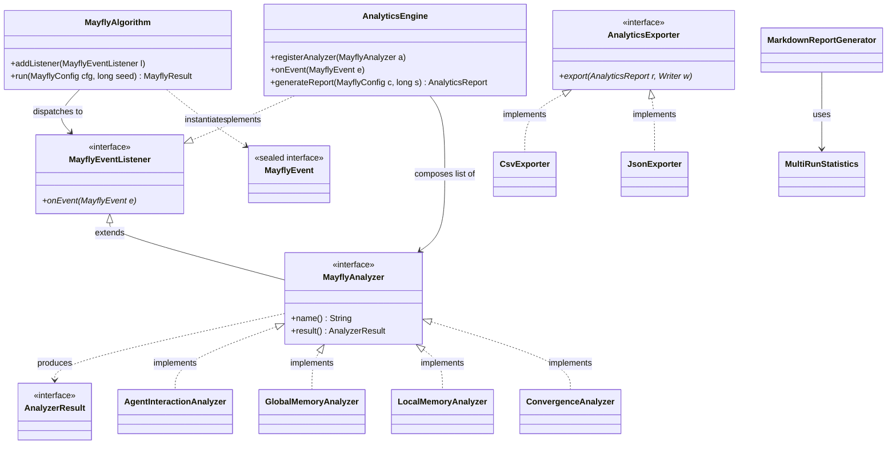

# 🏛️ Architecture Documentation — Mayfly Algorithm Optimization Suite

This document specifies the software architecture, core components, dynamic execution flows, and key architectural decisions (ADRs) governing the Swarm Intelligence Analytics framework.

---

## 1. Component Overview & Static Structure

The framework is decoupled into three primary subsystems:

1. **Core Evolutionary Engine** — manages population lifecycle, velocity updates, and event dispatching.
2. **Telemetry & Event Infrastructure** — dispatches real-time state changes via sealed observer interfaces.
3. **Analytics & Reporting Domain** — aggregates multi-run statistics, applies serialization strategies, and generates human-readable reports.

### 1.1 Component Class Diagram



---

## 2. Dynamic Execution Flow — Sequence Diagram

The sequence below illustrates a single synchronous iteration step inside the execution loop, detailing how evolutionary state changes dispatch decoupled telemetry events to registered analyzers via the `AnalyticsEngine`.

```mermaid
sequenceDiagram
    autonumber
    participant Loop as MayflyAlgorithm
    participant Engine as AnalyticsEngine
    participant Analyzers as Registered Analyzers

    Note over Loop: Iteration t begins
    Loop->>Engine: onEvent(IterationStarted(t, w))
    activate Engine
    Engine->>Analyzers: onEvent(IterationStarted)
    deactivate Engine

    Note over Loop: 1. Male Movement (Synchronous)
    loop for each male agent
        Loop->>Engine: onEvent(MaleUpdated(agent, isDance, prevFitness))
        Loop->>Engine: onEvent(PbestUpdated) [if fitness improves]
        Loop->>Engine: onEvent(GbestUpdated) [if global best improves]
    end

    Note over Loop: 2. Female Movement (Rank-Paired)
    loop for each female agent
        Loop->>Engine: onEvent(FemaleUpdated(agent, isAttracted, prevFitness))
        Loop->>Engine: onEvent(PbestUpdated) [if fitness improves]
        Loop->>Engine: onEvent(GbestUpdated) [if global best improves]
    end

    Note over Loop: 3. Mating & Crossover
    loop for each mating pair
        Loop->>Engine: onEvent(OffspringCreated(child1))
        Loop->>Engine: onEvent(OffspringCreated(child2))
        Loop->>Engine: onEvent(GbestUpdated) [if offspring improves global best]
    end

    Note over Loop: 4. Global Selection (pool sort → survivors)
    Loop->>Engine: onEvent(IterationCompleted(t, gbestFitness, survivors, matingMales, matingFemales))
    activate Engine
    Engine->>Analyzers: onEvent(IterationCompleted)
    Note over Analyzers: Compute diversity, plateaus,<br/>pair distances, trajectory points
    deactivate Engine

    Note over Loop: After final iteration
    Loop->>Engine: onEvent(RunCompleted(result))
    activate Engine
    Engine->>Analyzers: onEvent(RunCompleted)
    Note over Analyzers: Commit trailing streaks,<br/>finalize regression fits
    deactivate Engine
```

---

## 3. Architecture Decision Records (ADRs)

### ADR-01: Sealed Interface for the Telemetry Event Hierarchy

**Date:** 2026-05-10  
**Status:** Accepted

**Context:**  
The system dispatches multiple distinct domain events (`IterationStarted`, `MaleUpdated`, `FemaleUpdated`, `OffspringCreated`, `PbestUpdated`, `GbestUpdated`, `IterationCompleted`, `RunCompleted`) across decoupled packages. Each analyzer must distinguish these subtypes within a single `onEvent(MayflyEvent e)` handler.

**Decision:**  
`MayflyEvent` is declared as a `sealed interface` with an explicit `permits` clause enumerating all record implementations.

**Consequences:**
- ✅ Enables exhaustive, compiler-enforced pattern matching (`instanceof` checks). Adding a new event type forces all analyzer branches to be updated — preventing silent data loss.
- ✅ Full type safety without runtime reflection overhead.
- ✅ Records as event implementations are inherently immutable and value-typed, preventing accidental mutation during event propagation.
- ⚠️ Every new event type requires updating the `permits` clause and all `onEvent` handlers — intentional design constraint to ensure analyzer completeness.

---

### ADR-02: Stateless `MayflyAlgorithm` with External Seed Injection

**Date:** 2026-05-10  
**Status:** Accepted

**Context:**  
The original `MayflyOptimizer` stored `gbestPosition`, `gbestFitness`, and `rng` as instance fields. Re-running the optimizer on the same instance produced corrupted results because state leaked between runs. The seed was also hard-coded to `42L`, making deterministic reproducibility from outside impossible.

**Decision:**  
All mutable optimization state (`gbestPosition[]`, `gbestFitness[]`, `rng`) is declared as local variables inside `run(MayflyConfig cfg, long seed)`. The `RandomGenerator` (`Xoshiro256PlusPlus`) is constructed exclusively from the externally supplied seed.

**Consequences:**
- ✅ Multiple independent runs on the same `MayflyAlgorithm` instance are fully isolated — no state contamination.
- ✅ Bit-identical reproducibility: identical seed → identical floating-point trajectory.
- ✅ Enables the multi-run acceptance test (AT-1) and statistical robustness evaluation (AT-7, Task 4.3).
- ⚠️ Requires callers to manage seed diversity for multi-run scenarios (handled in `Main.java`).

---

### ADR-03: Single `AnalyticsEngine` Listener as Aggregator

**Date:** 2026-05-10  
**Status:** Accepted

**Context:**  
Registering every individual analyzer directly onto `MayflyAlgorithm` via `addListener(...)` would tightly couple the core algorithm to the analytics concern. The algorithm's listener list would grow with each new analyzer, violating the Open/Closed Principle.

**Decision:**  
A single `AnalyticsEngine` instance acts as the sole `MayflyEventListener` registered on `MayflyAlgorithm`. Internally, it maintains an ordered list of `MayflyAnalyzer` instances and sequentially forwards each received event to all registered analyzers.

**Consequences:**
- ✅ `MayflyAlgorithm` remains completely unaware of analytics concerns — pure algorithmic logic.
- ✅ Adding or removing analyzers requires no changes to the core algorithm.
- ✅ `generateReport()` can collect all results in a single centralized snapshot via `analyzer.result()` post-execution.
- ✅ Sequential (single-threaded) event delivery guarantees deterministic, reproducible metric accumulation per the concurrency constraint.

---

## 4. Reporting & Export Subsystem (Task 4.1)

The reporting subsystem uses the **Strategy Pattern** via `AnalyticsExporter`. This decouples the core simulation loop from target storage formats.

### 4.1 CSV Export Schema

The `CsvExporter` flattens nested population metrics into a relational flat-file format.

- **Delimiter:** Semicolon (`;`)
- **Line ending:** `\n`

```
MetricType;Iteration;KeyIdentifier;Value
<String>;<Integer>;<String>;<Double|Long|String>
```

**Example rows:**
```
META;0;Seed;42
AgentInteractionAnalyzer;1;FemaleAttractionRate;0.625
GlobalMemoryAnalyzer;42;GbestFitness;0.0000123456
```

### 4.2 JSON Export Schema

The `JsonExporter` serializes `AnalyticsReport` natively without third-party libraries. Schema:

```json
{
  "generatedAt": "2026-06-05T14:30:00Z",
  "seed": 42,
  "config": {
    "dimensions": 10,
    "populationSize": 40,
    "maxIterations": 1000
  },
  "byAnalyzer": {
    "GlobalMemoryAnalyzer": {
      "gbestUpdateCount": 87,
      "firstHittingIteration": -1,
      "gbestTrajectory": [
        {"iteration": 1, "gbestFitness": 4.1234},
        {"iteration": 2, "gbestFitness": 3.9876}
      ]
    }
  }
}
```

---

## 5. Statistical Aggregate Evaluation (Task 4.3)

`MultiRunStatistics` computes the following metrics over N independent runs:

| Metric | Formula |
| :--- | :--- |
| Mean | $\bar{x} = \frac{1}{n} \sum x_i$ |
| Standard Deviation | $s = \sqrt{\frac{\sum(x_i - \bar{x})^2}{n-1}}$ (sample variance) |
| Quantiles | Linear interpolation between sorted ranks |
| 95% CI | $\bar{x} \pm t_{\text{crit}, 0.05, n-1} \cdot \frac{s}{\sqrt{n}}$ |

For $N=10$ runs ($df=9$): $t_{\text{crit}} = 2.262$

---

## 6. JGiven Acceptance Test Report (Task 3.3)

All 6 mandatory BDD scenarios (AT-1 to AT-6) plus the multi-run scenario (AT-7) are implemented in `MayflyAlgorithmBddTest`. The HTML report is generated automatically at:

```
target/jgiven-reports/html/index.html
```

Run with:
```bash
mvn clean verify
```


Tag assignments visible in the report:

| Tag | Scenarios |
| :--- | :--- |
| `global-memory` | AT-3 |
| `agent-interaction` | AT-4 |
| `local-memory` | AT-5 |
| `convergence` | AT-6, AT-7 |