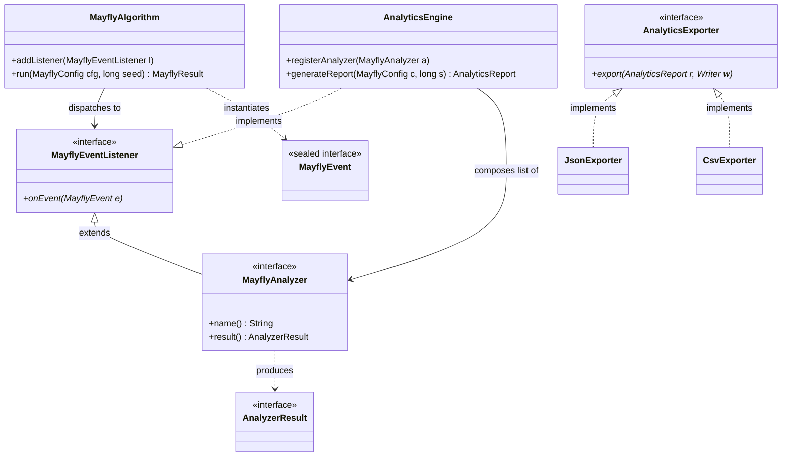

# 🏛️ Architecture Documentation — Mayfly Algorithm Optimization Suite

This document specifies the software architecture, core components, dynamic execution flows, and key architectural decisions (ADRs) governing the Swarm Intelligence Analytics framework.

---

## 1. Component Overview & Static Structure

The framework is decoupled into three primary subsystems:
1. **Core Evolutionary Engine:** Manages population lifecycle and velocity updates.
2. **Telemetry & Event Infrastructure:** Dispatches real-time state changes via observer interfaces.
3. **Analytics & Reporting Domain:** Aggregates multi-run statistics, applies serialization strategies, and generates user-readable reports.

### Component Class Diagram
The static class hierarchies, strategies, and compositions are modeled via the following Mermaid diagram:



## 📊 Akzeptanztests & JGiven-HTML-Report (Aufgabe 3.3)

Die funktionalen Abnahmekriterien (Szenarien `AT-1` bis `AT-6`) wurden vollständig mittels des BDD-Frameworks **JGiven** implementiert.

### Report-Generierung & Lokalisation
Der interaktive HTML-Report wird bei jedem vollständigen Build-Vorgang automatisiert erzeugt. Um den Report zu generieren und zu betrachten, führen Sie folgende Befehle im Projektverzeichnis aus:


### Report-Dashboard & Tag-Übersicht

Nachfolgend finden Sie den visuellen Nachweis des generierten JGiven-Dashboards inklusive der geforderten Tag-Klassifizierungen:


```bash
# Führt alle Tests aus und generiert den HTML-Report im target-Ordner
mvn clean verify
```

### 4.1 Daten-Export & Schemaspezifikation

Die Serialisierungskomponente ist über das Entwurfsmuster *Strategy* mittels des Interfaces `AnalyticsExporter` implementiert. Dies ermöglicht die Entkopplung der Simulationslogik von den Dateiformaten.

#### 4.1.1 CSV-Export-Schema (Flachstruktur für Zeitreihen)
Der `CsvExporter` überführt verschachtelte Strukturen tabellarisch in ein unmaskiertes Flachdateiformat.
* **Trennzeichen:** Semikolon (`;`)
* **Zeilenumbruch:** Standard-Linefeed (`\n`)

**Strukturübersicht:**
```text
MetricType;Iteration;KeyIdentifier;Value
<String>;<Integer>;<String>;<Double|Long|String>
```

#### 4.1.2 JSON-Export-Schema (Hierarchisch & Nativ)
Der `JsonExporter` überführt den `AnalyticsReport` reflexionsfrei ohne Verwendung externer Frameworks in ein valides JSON-Dokument. Das zugrundeliegende Struktur-Schema ist wie folgt definiert:

```json
{
  "$schema": "https://json-schema.org/draft/2020-12/schema",
  "title": "AnalyticsReport",
  "type": "object",
  "properties": {
    "generatedAt": { "type": "string", "format": "date-time" },
    "seed": { "type": "integer" },
    "config": {
      "type": "object",
      "properties": {
        "dimensions": { "type": "integer" },
        "populationSize": { "type": "integer" },
        "maxIterations": { "type": "integer" }
      }
    },
    "byAnalyzer": {
      "type": "object",
      "additionalProperties": { "type": "object" }
    }
  },
  "required": ["generatedAt", "seed", "config", "byAnalyzer"]
}
```

### 4.3 Statistische Auswertung über mehrere Läufe

Zur Validierung der stochastischen Robustheit des Mayfly-Algorithmus wurde ein statistisches Auswertungsmodul (`MultiRunStatistics`) implementiert. Da populationsbasierte Metaheuristiken stark von der Initialisierung abhängen, reicht die Betrachtung eines einzelnen Laufs nicht aus.

#### Berechnungsmethodik:
* **Mittelwert & Standardabweichung:** Berechnet über die Stichprobenvarianz ($n-1$) zur unverfälschten Schätzung der Grundgesamtheit.
* **Quantile (Median, Q1, Q3):** Präzise Positionsbestimmung über lineare Interpolation zwischen den stochastischen Rängen.
* **95 % Konfidenzintervall:** Berechnet anhand der Student-t-Verteilung, um dem endlichen Stichprobenumfang Rechnung zu tragen:
  $$CI = \bar{x} \pm t_{crit, 0.05, df} \cdot \frac{s}{\sqrt{n}}$$
  *Für $N=10$ Läufe ($df=9$) wird der exakte Tabellenwert $t_{crit} = 2.262$ herangezogen.*

Report Dashboard & Tag OverviewBelow is the visual verification of the generated JGiven dashboard interface, including the structural test tag classifications (global-memory, local-memory, agent-interaction, convergence):

## 💾 2. Reporting, Export & Serialization (Task 4.1)
The reporting subsystem utilizes the Strategy Pattern via the unified AnalyticsExporter interface. This ensures total decoupling between the core evolutionary simulation loop and the target storage formats.

### 2.1.1 CSV Export Schema (Flat Time-Series Structure)
The CsvExporter flattens hierarchical, nested population matrix updates into a strictly relational flat-file row model, optimized for immediate analysis in tools like Excel, Python, or R.
* Delimiter: Semikolon (;)
* Line Ending: Standard-Linefeed (\n)

Structural Schema Specification:
```text
PlaintextMetricType;Iteration;KeyIdentifier;Value
<String>;<Integer>;<String>;<Double|Long|String>
```

### 2.1.2 JSON Export Schema (Hierarchical & Native)
The JsonExporter serializes the comprehensive AnalyticsReport completely natively and reflection-free without utilizing any third-party framework (e.g., Jackson or Gson). The layout complies with the following strict Structural Schema definition:
```bash
JSON{
"$schema": "[https://json-schema.org/draft/2020-12/schema](https://json-schema.org/draft/2020-12/schema)",
"title": "AnalyticsReport",
"type": "object",
"properties": {
"generatedAt": { "type": "string", "format": "date-time" },
"seed": { "type": "integer" },
"config": {
"type": "object",
"properties": {
"dimensions": { "type": "integer" },
"populationSize": { "type": "integer" },
"maxIterations": { "type": "integer" }
}
},
"byAnalyzer": {
"type": "object",
"additionalProperties": { "type": "object" }
}
},
"required": ["generatedAt", "seed", "config", "byAnalyzer"]
}
```

## 📈 3. Statistical Aggregate Evaluation & Markdown Generation (Task 4.2 & 4.3)
The MarkdownReportGenerator automatically maps multidimensional execution states into an autonomous markdown artifact.
### 3.1 Inline Sparkline Visualization
To preserve layout-independent visual progress tracking without relying on external image asset rendering, the system samples the global best trajectory values (gbest) and maps them mathematically onto 8 distinct Unicode Block characters (ranging from U+2581 to U+2588). Better (lower) fitness metrics are drawn using lower-tier block fragments to provide an intuitive visualization.
* Example Sample Render: ██▇▆▅▄▃▃▂▂      

### 3.2 Stochastic Multi-Run Robustness
Population-based metaheuristics exhibit variance based on random seed distributions. The suite evaluates system stability by tracking sample variance over independent multi-run series ($N \ge 10$).

#### Quantile Extraction: 
Computed using precise linear index interpolation between sorted values.
95% Confidence Interval (CI): Formulated via standard Student-t distributions to account for tight finite sample limits:$$\text{CI} = \bar{x} \pm t_{\text{crit}, 0.05, \text{df}} \cdot \frac{s}{\sqrt{n}}$$For exactly $N=10$ runs ($\text{df}=9$), the lookup filter applies the exact standard coefficient $t_{\text{crit}} = 2.262$.🏛️ 4. Static Subsystems & Dynamic Interaction (Task 5.1)4.1 Component Class DiagramThe architectural dependencies and observer design layouts connecting the evolutionary swarm logic to the evaluation engine are structured below:Code-SnippetclassDiagram
direction TB

    class MayflyAlgorithm {
        +addListener(MayflyEventListener l)
        +run(MayflyConfig cfg, long seed) MayflyResult
    }

    class MayflyEventListener {
        <<interface>>
        +onEvent(MayflyEvent e)*
    }

    class MayflyAnalyzer {
        <<interface>>
        +name() String
        +result() AnalyzerResult
    }

    class AnalyticsEngine {
        +registerAnalyzer(MayflyAnalyzer a)
        +generateReport(MayflyConfig c, long s) AnalyticsReport
    }

    class AnalyticsExporter {
        <<interface>>
        +export(AnalyticsReport r, Writer w)*
    }

    class MayflyEvent {
        <<sealed interface>>
    }

    class AnalyzerResult {
        <<interface>>
    }

    %% Relationships
    MayflyAlgorithm --> MayflyEventListener : dispatches to
    MayflyEventListener <|-- MayflyAnalyzer : extends
    AnalyticsEngine ..|> MayflyEventListener : implements
    AnalyticsEngine --> MayflyAnalyzer : composes list of
    
    MayflyAnalyzer ..> AnalyzerResult : produces
    MayflyAlgorithm ..> MayflyEvent : instantiates
    
    AnalyticsExporter <|.. JsonExporter : implements
    AnalyticsExporter <|.. CsvExporter : implements
4.2 Dynamic Execution Loop SequenceThe sequence below illustrates a single synchronous iteration step inside the execution loop, detailing how evolutionary state alterations dispatch asynchronous decoupled telemetry event markers to child components:Code-SnippetsequenceDiagram
autonumber
participant Loop as MayflyAlgorithm Loop
participant Engine as AnalyticsEngine
participant Analyzers as Registered Analyzers

    Note over Loop: Iteration t starts
    Loop->>Engine: onEvent(IterationStarted)
    activate Engine
    Engine->>Analyzers: onEvent(IterationStarted)
    deactivate Engine
    
    Note over Loop: 1. Male Movement (Synchronous)
    Loop->>Engine: onEvent(MaleUpdated)
    Loop->>Engine: onEvent(PbestUpdated [if fitness improves])
    
    Note over Loop: 2. Female Movement (Ranked-Pairing)
    Loop->>Engine: onEvent(FemaleUpdated)
    Loop->>Engine: onEvent(PbestUpdated [if fitness improves])
    
    Note over Loop: 3. Mating & Crossover
    Loop->>Engine: onEvent(OffspringCreated)
    
    Note over Loop: 4. Selection & Survival Filtering
    Loop->>Engine: onEvent(IterationCompleted)
    activate Engine
    Engine->>Analyzers: onEvent(IterationCompleted)
    Note over Analyzers: Process sliding windows,<br/>diversity deltas & plateaus
    deactivate Engine
📝 5. Architecture Decision Records (ADRs)ADR 01: Sealed Interface for Telemetry Event HierarchyContext: The system dispatches multiple distinct domain events (IterationStarted, MaleUpdated, PbestUpdated, etc.) across decoupled packages. Analyzers need to distinguish these subtypes within their unified event-handling routine.Decision: We declared MayflyEvent as a sealed interface explicitly enumerating all permissible implementing record containers via the permits clause.Consequences:Positive: Enables compiler-enforced pattern matching checking (switch or if instanceof). If a new evolutionary stage event is added to the domain, the compiler flags missing analyzer branches, preventing unhandled event errors.Positive: Complete type safety without performance-intensive fallback reflection.ADR 02: Stateless Character-Driven Non-Streaming In-Memory ExportContext: The AnalyticsExporter interface requires exporting full telemetry sets to JSON and CSV formats.Decision: We rejected third-party dependency runtime chunk streaming (like Jackson/Gson token-streaming) in favor of building an independent memory-buffered, character-escaped native writing sequence.Consequences:Positive: Zero external runtime binary dependencies, fully satisfying target assignment constraints.Positive: High performance and minimal footprint because the analytical reports are finite, constrained by the max iterations. Building an explicit object-graph chunk runner is omitted.Negative: If max iteration counts or dimension limits scale towards memory boundaries ($10^7+$ trajectory markers), storing transient strings ahead of writing risks garbage collection pressure.ADR 03: Unified Listener Aggregator via AnalyticsEngine CoordinatorContext: Registering every tracking analyzer directly onto the core MayflyAlgorithm instance increases connection overhead and couples the algorithm code directly to metric tracking variations.Decision: Implemented a single entry-point manager (AnalyticsEngine) that acts as the sole listener attached to the core loop. It aggregates and forwards events down to child trackers internally.Consequences:Positive: Encapsulates the core algorithm logic; the core algorithm only knows it is notifying a simple MayflyEventListener.Positive: Facilitates clean report generation out of a single centralized map snapshot state post-execution.